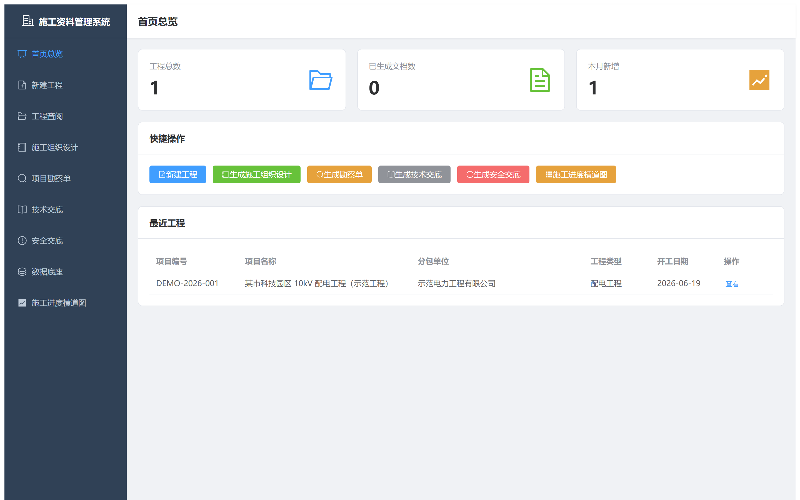
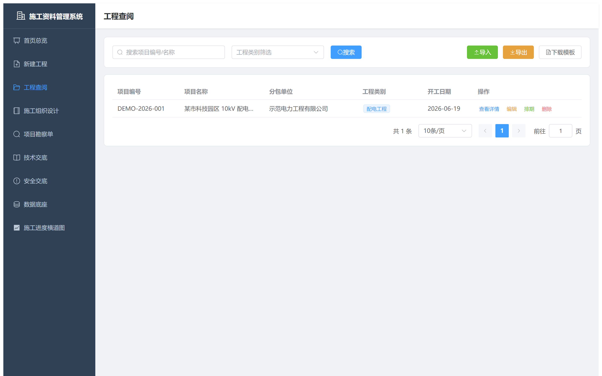
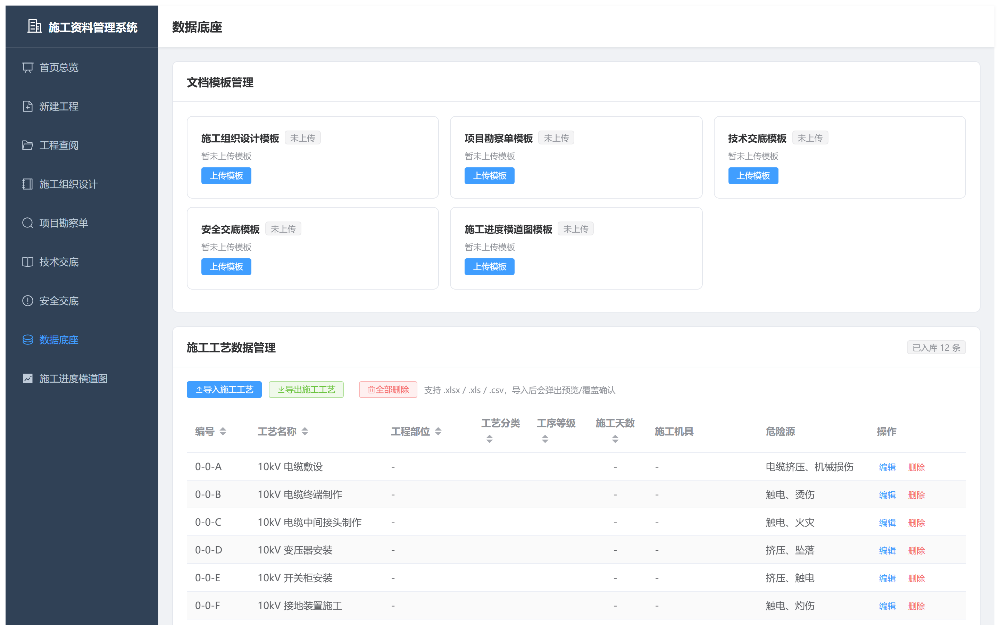
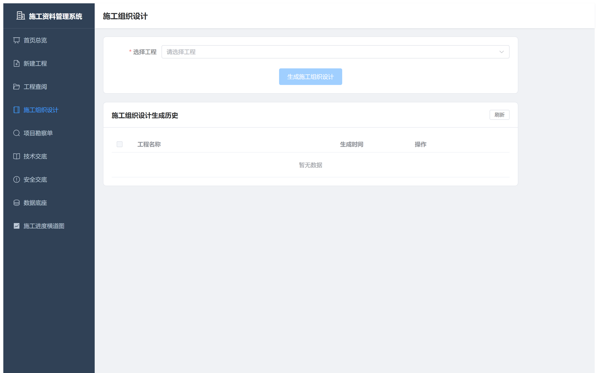
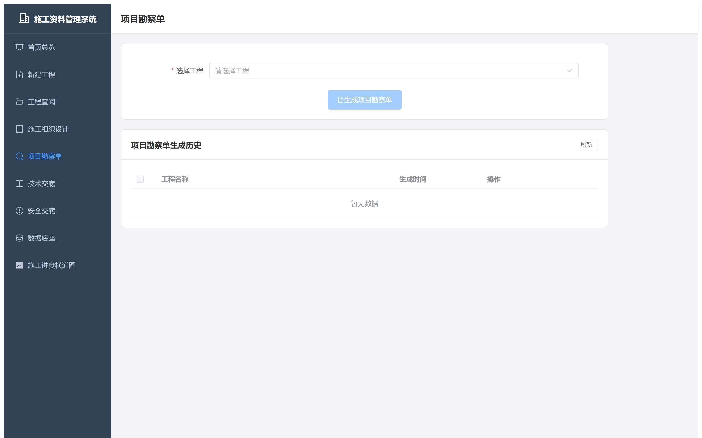
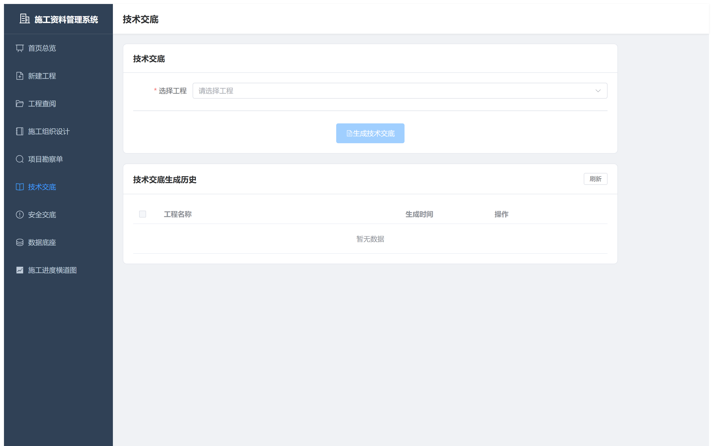
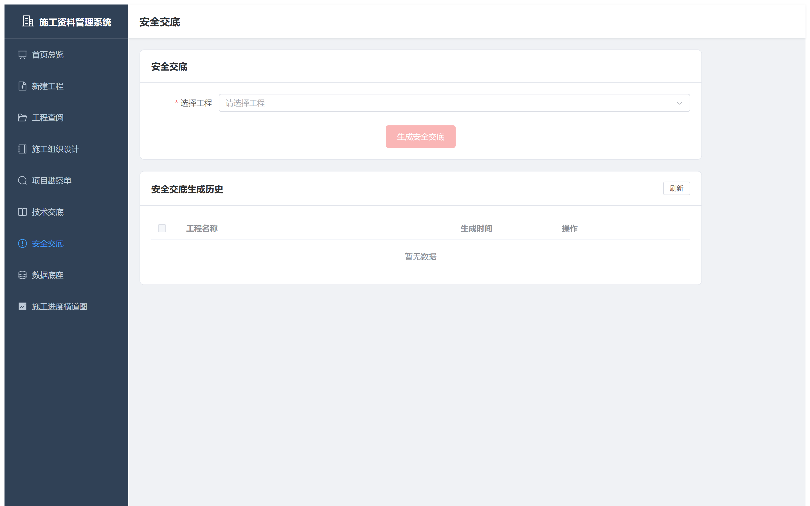
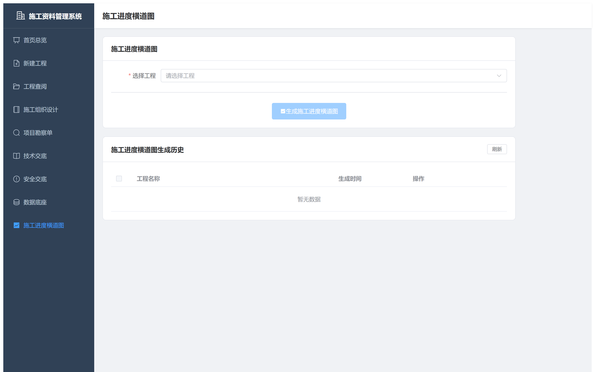

# 施工资料智能生成系统

> 面向电力施工单位的「文档智能体」 — 选工程，点生成，5 秒输出 5 份标准 Word + 1 张进度横道图。
>
> 🏆 参赛项目：[TRAE AI 创造力大赛 · 学习工作赛道](https://www.trae.cn/ai-creativity)


---

## 🎯 一句话

把资料员从「4 小时敲字」里解放出来 — 选工程，点按钮，5 秒下载标准 Word 文档。

---

## 📸 实际运行界面

### 首页总览


### 工程列表


### 数据底座


### 5 大文档生成模块

| 施工组织设计 | 项目勘察单 |
|---|---|
|  |  |

| 技术交底 | 安全交底 |
|---|---|
|  |  |

### 施工进度横道图


---

## 🚀 在线体验 DEMO

👉 **[点击查看 创意产物 HTML](competition/product.html)** — 单页 H5 作品，展示作品形态、目标用户、价值数据

> 推荐用 Chrome / Edge 打开 `competition/product.html`，包含动画、滚动渐显等效果。

---

## ✨ 五大模块 · 一键生成

| # | 模块 | 输出 | 占位符 |
|---|---|---|---|
| M-01 | 施工组织设计 | DOCX | 17 |
| M-02 | 项目勘察单 | DOCX | 11 |
| M-03 | 技术交底记录 | DOCX | 6 |
| M-04 | 安全交底记录 | DOCX | 6 |
| M-05 | 施工进度横道图 | XLSX | — |

每个模块都遵循统一交互：**「选择工程 → 点击生成 → 预览 → 下载」**。人员、工艺、日期等数据由后端从工程关联自动拉取 — 前端没有任何多余选项。

---

## 📊 看得见的效率

| 指标 | 优化前 | 优化后 |
|---|---|---|
| 单份文档耗时 | 4 小时 | **5 秒** |
| 文档退回率 | 68% | **0%**（自动校验） |
| 每项目年节约人工 | — | **≈ 200 小时** |

---

## 🏗️ 技术栈

| 层级 | 选型 | 理由 |
|---|---|---|
| 前端 | Vue 3 + Vite + Element Plus | 上手快，组件全 |
| 后端 | FastAPI + SQLAlchemy | Python 生态，文档自动生成 |
| 数据库 | SQLite | 零部署，单文件 |
| 文档生成 | python-docx + openpyxl | 业界标准库 |
| 文档预览 | mammoth | DOCX → HTML 实时预览 |

---

## 🧪 演示数据说明

`demo/screenshots/` 中所有界面数据均为**虚构**，用于：
- TRAE 比赛公开 Demo
- GitHub 公开预览

工程名：某市科技园区 10kV 配电工程（示范工程）  
人员：张明、李华、王芳、赵刚、刘伟 等 30 名虚构人员  
所有公司名、地名、联系电话等均无真实信息。

---

## 📂 仓库内容说明

```
construction-document-system/    ← 本仓库（DEMO 公开版）
├── README.md                    # 本文件
├── LICENSE                      # MIT 协议
├── .gitignore
├── competition/                 # 比赛材料
│   └── product.html             # 创意产物 HTML 附件
└── demo/                        # 演示素材
    └── screenshots/             # 8 张实际运行截图
```

> 📌 **完整源码**（后端 / 前端 / 模板）暂未公开。如需评审，请联系作者获取。

---

## 🤝 参与贡献

欢迎 PR、Issue 与 Fork。本项目采用 MIT 协议，可自由用于商业或学习用途。

---

## 📜 协议

[MIT](LICENSE) © 2026 Construction Document System Contributors

---

## 🏆 关于比赛

本项目为 **TRAE AI 创造力大赛初赛** 参赛作品（学习工作赛道）。  
使用 [TRAE IDE](https://www.trae.cn/) + Auto 模型开发。  
创意产物 HTML 见 [`competition/product.html`](competition/product.html)。